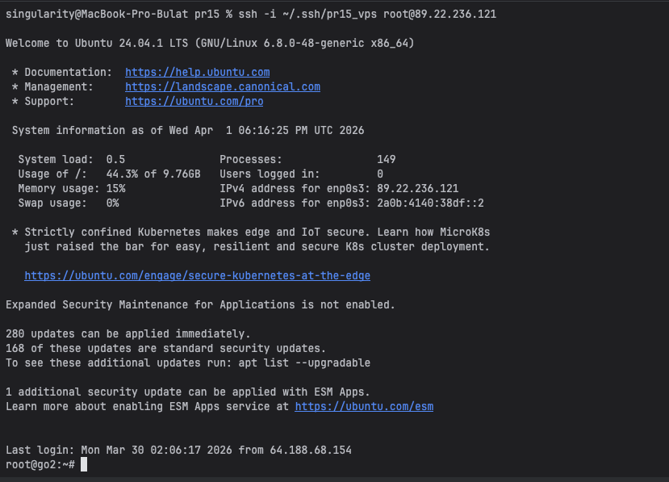
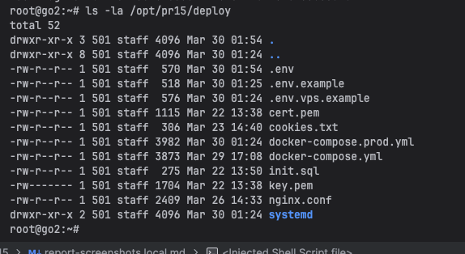
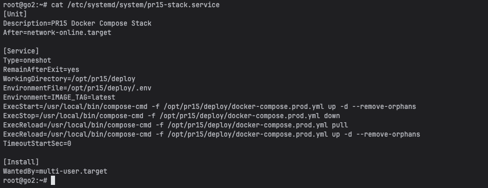
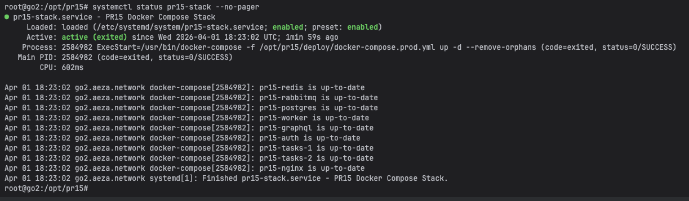
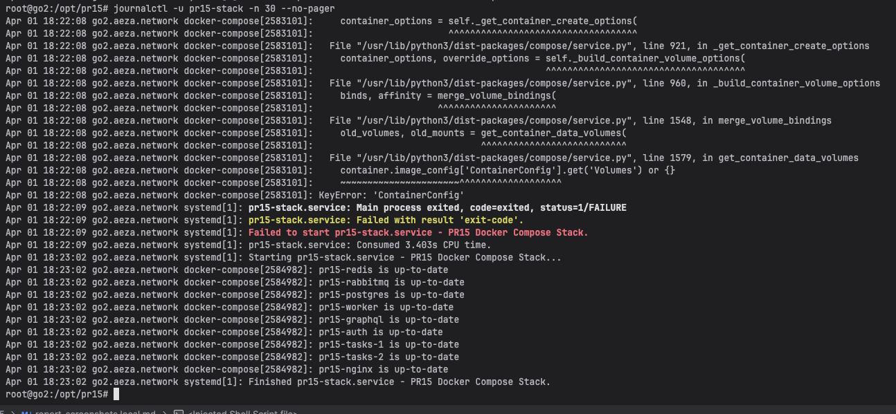
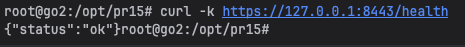
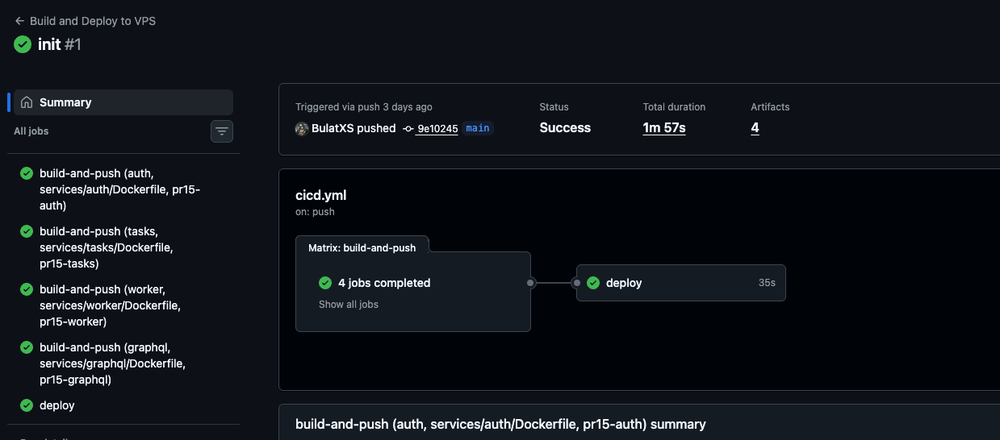
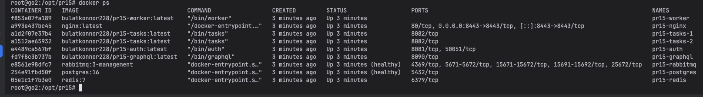
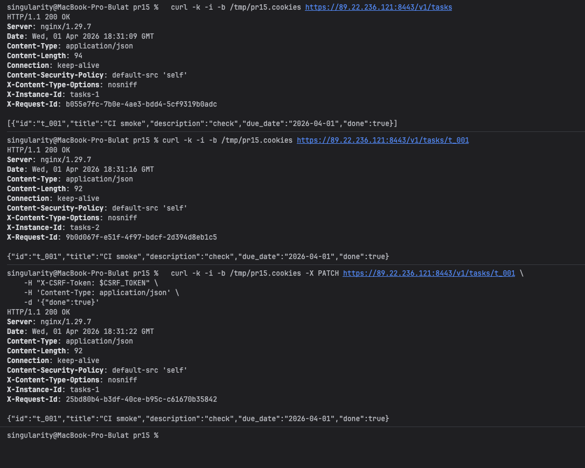

# Практическое занятие №15
# Саттаров Булат Рамилевич ЭФМО-01-25
# Деплой приложения на VPS. Настройка systemd

## Схема деплоя

```text
push в main -> GitHub Actions -> build/push Docker images (Docker Hub) ->
SSH на VPS -> docker-compose pull/up -> сервис доступен через NGINX
```

## 1. IP/хост VPS и факт подключения по SSH


```bash
ssh -i ~/.ssh/pr15_vps root@89.22.236.121
```



## 2. Где размещено приложение и структура директорий

Размещение проекта на VPS:

```bash
/opt/pr15/deploy
```

```bash
ls -la /opt/pr15/deploy
```



В данной работе выбран контейнерный деплой (вариант B), поэтому вместо отдельного бинарника используется `docker-compose.prod.yml`.

## 3. Пример service unit и пояснение параметров

Unit-файл:

```bash
/etc/systemd/system/pr15-stack.service
```

Ключевые параметры:
- `WorkingDirectory=/opt/pr15/deploy` - рабочая директория стека.
- `EnvironmentFile=/opt/pr15/deploy/.env` - переменные окружения отдельно от кода.
- `ExecStart` - запуск стека.
- `ExecReload` - обновление образов и перезапуск контейнеров.
- `RemainAfterExit=yes` - oneshot-unit остается в активном состоянии после выполнения.



## 4. Пример `systemctl status`

```bash
systemctl status pr15-stack --no-pager
```



## 5. Пример `journalctl -u pr15-stack -n 30`

```bash
journalctl -u pr15-stack -n 30 --no-pager
```

В логах видно и ошибочный запуск, и последующее успешное завершение (`Finished pr15-stack.service`).



## 6. Проверка /health и ответ сервиса

```bash
curl -k https://127.0.0.1:8443/health
```

Ответ:

```json
{"status":"ok"}
```



## 7. Процедура обновления и отката

### Обновление версии

1. Выполнить `git push` в `main`.
2. GitHub Actions собирает образы и публикует их в Docker Hub.
3. Deploy job подключается к VPS по SSH и выполняет:
```bash
docker-compose -f docker-compose.prod.yml pull
docker-compose -f docker-compose.prod.yml up -d --remove-orphans
```

Подтверждение успешного обновления:





### Откат

1. В файле `/opt/pr15/deploy/.env` на VPS установить предыдущий тег:
```env
IMAGE_TAG=<previous_commit_sha>
```
2. Применить:
```bash
systemctl reload pr15-stack
```


## Проверка эндпоинтов


